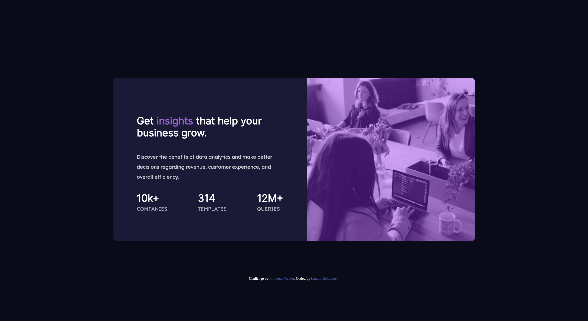
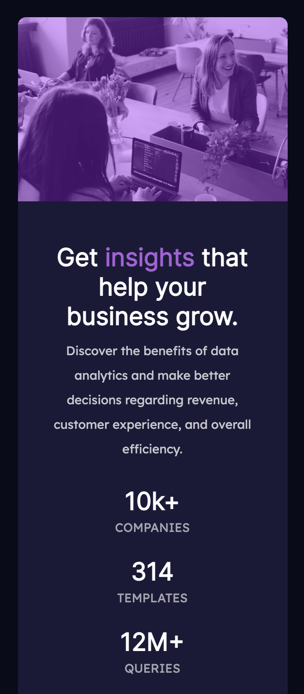

# Frontend Mentor - Stats preview card component solution

This is a solution to the [Stats preview card component challenge on Frontend Mentor](https://www.frontendmentor.io/challenges/stats-preview-card-component-8JqbgoU62). Frontend Mentor challenges help you improve your coding skills by building realistic projects.

## Table of contents

- [Overview](#overview)
  - [The challenge](#the-challenge)
  - [Screenshot](#screenshot)
  - [Links](#links)
- [My process](#my-process)
  - [Built with](#built-with)
  - [What I learned](#what-i-learned)
  - [Continued development](#continued-development)
  - [Useful resources](#useful-resources)
- [Author](#author)
- [Acknowledgments](#acknowledgments)

## Overview

### The challenge

Users should be able to:

- View the optimal layout depending on their device's screen size

### Screenshot




### Links

- Solution URL: [Add solution URL here](https://your-solution-url.com)
- Live Site URL: [Add live site URL here](https://your-live-site-url.com)

## My process

### Built with

- Semantic HTML5 markup
- CSS custom properties
- Flexbox
- Mobile-first workflow

### What I learned

I learned how to add a cool image with a nice purple overlay.
I was able to do it with this css.

```css
.img {
  border-radius: 10px 10px 0 0;
  background-image: url(./images/image-header-mobile.jpg);
  background-repeat: no-repeat;
  background-size: cover;
  width: 100%;
  height: 60vw;
}

.layer {
  background-color: rgba(164, 19, 254, 0.4);
  width: 100%;
  height: 100%;
  border-radius: 10px 10px 0 0;
}
```

### Continued development

I want to focus more on mobile first development to make nice, reponsive websites. I also want to incorporate more images into my websites.

## Author

- Website - [Landon Schlangen](https://www.landonschlangen.com)
- Frontend Mentor - [@Landon345](https://www.frontendmentor.io/profile/Landon345)
- LinkedIn - [Profile](https://www.linkedin.com/in/landon-schlangen-a3989a16b/)

## Acknowledgments

I was able to do this project on my own in about 1 hour and 30 minutes. I completed it on 5/9/2021, and it was a great starter project to get into frontendmentor.
